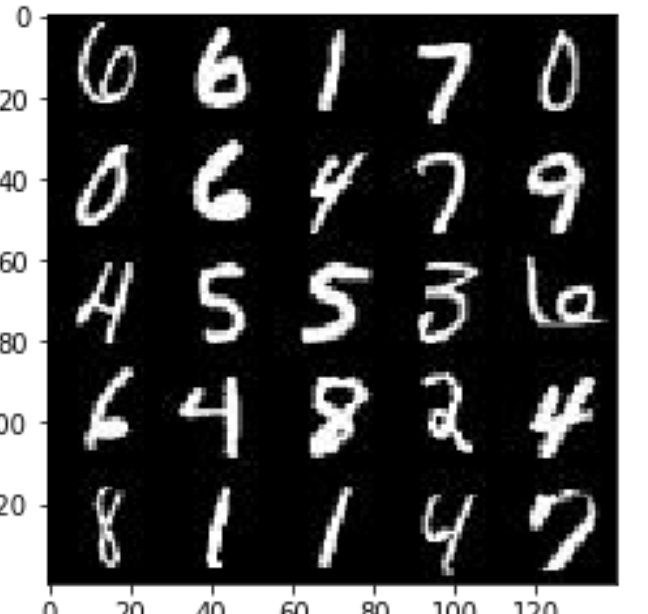
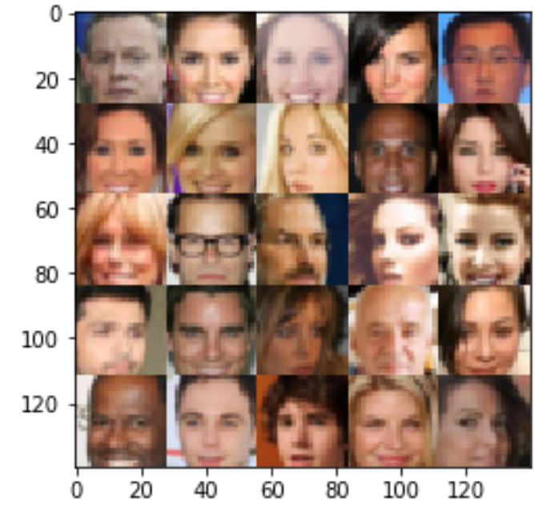

# dlnd_face_generation-master

Generative Adversarial Network (GAN) implementation  with TensorFlow

This kernel generates 
1. new images of human faces using  CelebFaces Attributes Dataset [(CelebA)](http://mmlab.ie.cuhk.edu.hk/projects/CelebA.html) [(CelebA)](http://mmlab.ie.cuhk.edu.hk/projects/CelebA.html) contains over 200,000 celebrity imagest.

2. handwritten digits from [MNIST](http://yann.lecun.com/exdb/mnist/)


## Usage

While in dlnd_face_generation-master directory do run command

```
jupyter notebook
```

You'll be seing a similar output in your terminal
```
[I 21:26:41.666 NotebookApp] [nb_conda_kernels] enabled, 6 kernels found
[I 21:26:42.460 NotebookApp] JupyterLab beta preview extension loaded from /anaconda3/lib/python3.6/site-packages/jupyterlab
[I 21:26:42.460 NotebookApp] JupyterLab application directory is /anaconda3/share/jupyter/lab
[I 21:26:43.001 NotebookApp] [nb_anacondacloud] enabled
[I 21:26:43.006 NotebookApp] [nb_conda] enabled
[I 21:26:43.099 NotebookApp] ✓ nbpresent HTML export ENABLED
[W 21:26:43.099 NotebookApp] ✗ nbpresent PDF export DISABLED: No module named 'nbbrowserpdf'
[I 21:26:43.103 NotebookApp] Serving notebooks from local directory: /Users/admin/tmpdlnd/deep_m_learning/dlnd_tv_script_generation
[I 21:26:43.103 NotebookApp] 0 active kernels
[I 21:26:43.103 NotebookApp] The Jupyter Notebook is running at:
[I 21:26:43.103 NotebookApp] http://localhost:8888/?token=5f1104c958547d8430c7dcdb86b9d8f4a90e933bace32d0a
[I 21:26:43.103 NotebookApp] Use Control-C to stop this server and shut down all kernels (twice to skip confirmation).
[C 21:26:43.107 NotebookApp] 
    
    Copy/paste this URL into your browser when you connect for the first time,
    to login with a token:
        http://localhost:8888/?token=5f1104c958547d8430c7dcdb86b9d8f4a90e933bace32d0a
[I 21:26:43.314 NotebookApp] Accepting one-time-token-authenticated connection from ::1
```
After running this command a new tab will be opened in your browser window. Run all the cells in the notebook. It may tell a while before it completes. 

## Recomendation
Run the notebook in a GPU powered host.


## Example of generated results

handriting digits| generated human faces
---------------- | ---------------------
 | 


## Example of generated human faces


